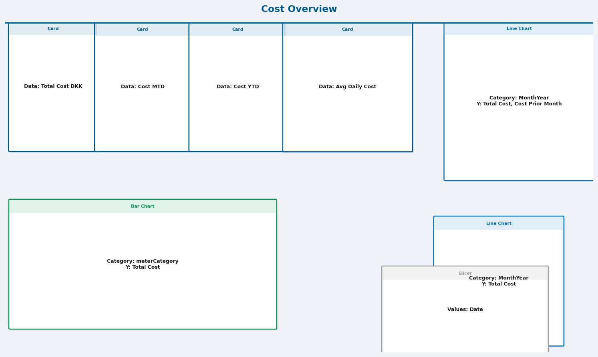
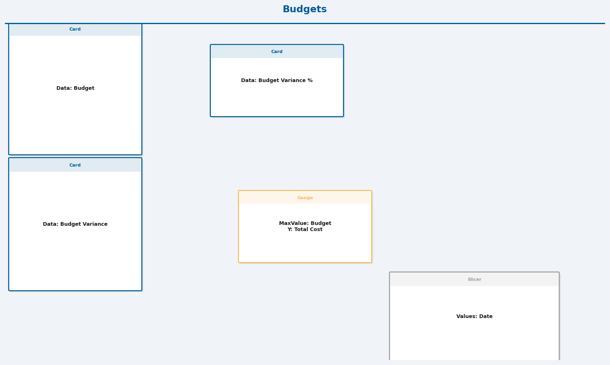
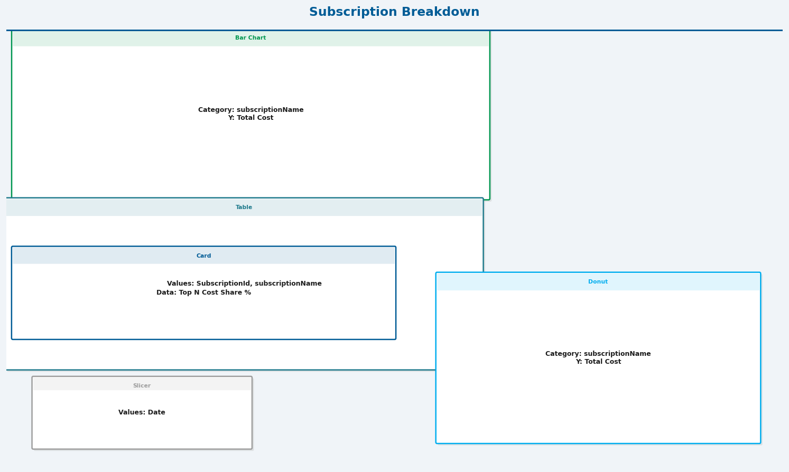
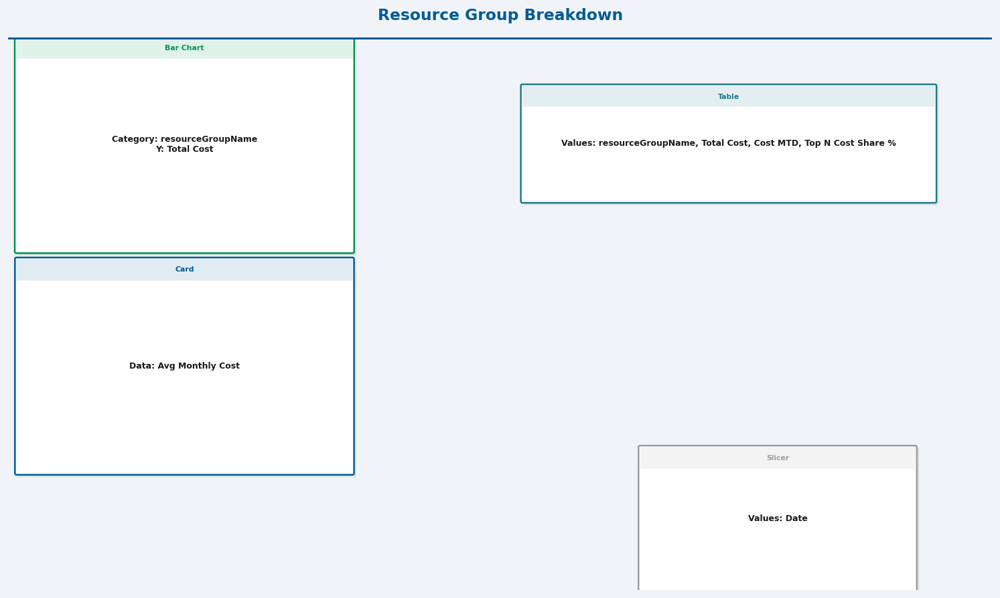
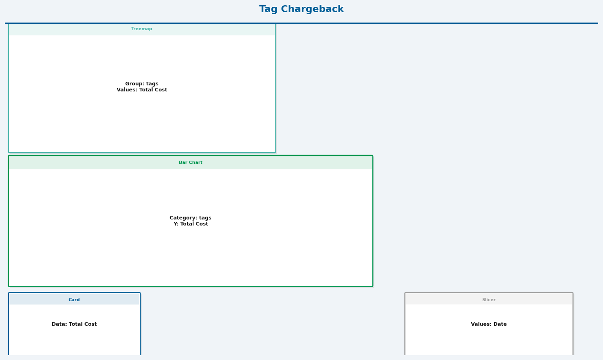
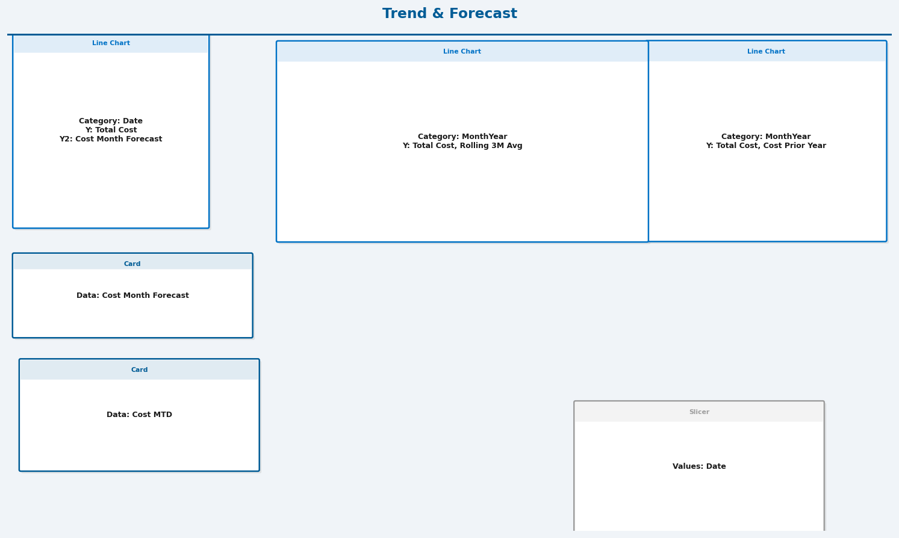
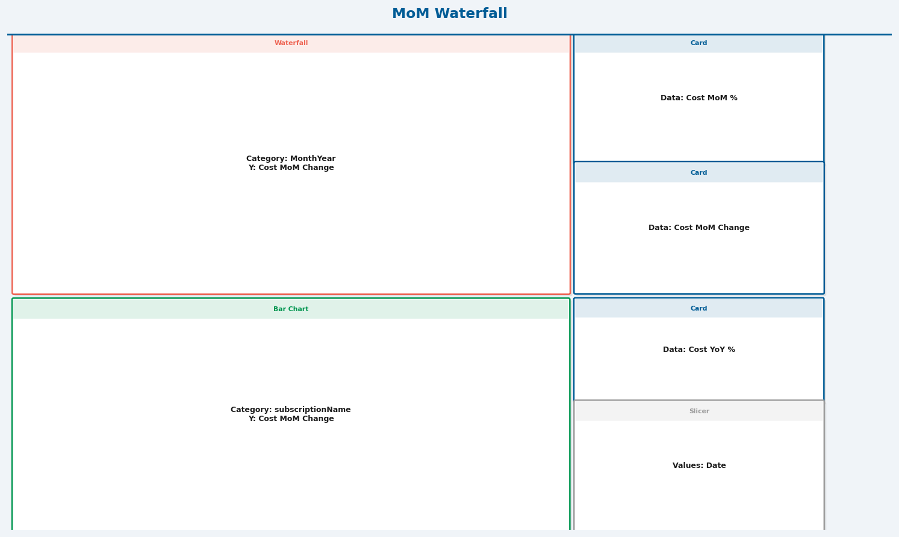

# TD SYNNEX – Azure CSP Cost Reporting

> 🇩🇰 [Dansk version](README.da.md)

This kit gives TD SYNNEX and its reseller partners a fully automated, end-to-end Azure cost reporting solution built on native Microsoft tooling — no third-party services, no manual data pulls.

Azure Cost Management exports are scheduled to run daily and write CSV files directly to Azure Blob Storage. A Power BI report connected to that storage reads, combines, and models the data automatically on every refresh. The result is a live, self-updating dashboard that shows spend by subscription, resource group, service, and tag — with month-over-month variance, year-on-year trends, budget tracking, and a month-end forecast built in.

The solution supports two deployment modes. In **subscription mode**, exports are scoped to individual Azure subscriptions and authenticated via managed identity — suitable for direct customers or internal use. In **billing account mode**, exports are scoped to the CSP billing account and authenticated via SAS token, enabling TD SYNNEX to pull cost data across all reseller customer subscriptions from a single deployment. Both modes are deployed via a single Bicep template and a PowerShell or Bash script.

The Power BI report is distributed as both a `.pbix` single file and a `.pbip` project folder. The project format stores all report layout and data model definitions as plain-text TMDL and JSON files, making the report fully auditable and compatible with Git version control and Microsoft Fabric CI/CD pipelines. The theme and colour palette are externalised to a JSON file for straightforward white-labelling.

## Project structure

```
README.md
bicep/
  main.bicep                    Storage account, blob container, and RBAC role assignment
  export-sub.bicep              Cost Management export at subscription scope (managed identity)
  export-billing.bicep          Cost Management export at billing account / CSP scope (SAS token)
scripts/
  deploy.ps1                    Unified PowerShell deployment script (subscription + billingAccount modes)
  deploy.sh                     Unified Bash deployment script (mirrors deploy.ps1)
powerbi/
  tds_cc.pbix                   Single-file Power BI report — open directly in Power BI Desktop
  tds_cc.pbip                   Power BI Project entry point — open for Git/Fabric workflows
  tds_cc.Report/                Report artifact folder (required by .pbip)
    definition.pbir             Report definition — links report to the semantic model
    diagramLayout.json          Visual canvas positions
    report.json                 Full report layout (pages, visuals, filters)
    .platform                   Fabric metadata (type: Report)
    StaticResources/
      RegisteredResources/      Registered TD SYNNEX theme file
      SharedResources/
        BaseThemes/             Base Power BI theme (CY26SU02)
  tds_cc.SemanticModel/         Semantic model artifact folder (required by .pbip)
    model.bim                   TMDL data model (tables, measures, relationships, partitions)
                                ⚠ Generated by Power BI Desktop via File → Save a copy → .pbip
                                  Not included in this kit — must be produced from tds_cc.pbix
    definition.pbism            Semantic model definition
    .platform                   Fabric metadata (type: SemanticModel)
  tdsynnex-theme.json           Power BI colour theme (TD SYNNEX brand)
  queries.pq                    Power Query (M) — combines daily CSVs from blob storage
  calendar.dax                  Date table calculated table definition
  measures.dax                  20 DAX measures (totals, MTD/QTD/YTD, MoM, YoY, forecast, budget)
  report.json                   Report structure blueprint (reference only — cannot be imported)
  visuals/                      Page layout diagrams extracted from tds_cc.pbix
    page_Cost_Overview.png
    page_Budgets.png
    page_Subscription_Breakdown.png
    page_Resource_Group_Breakdown.png
    page_Tag_Chargeback.png
    page_Trend_and_Forecast.png
    page_MoM_Waterfall.png
```

## Deployment modes

| | `subscription` | `billingAccount` |
|---|---|---|
| Export scope | Single subscription | Full CSP billing account |
| Auth | System-assigned managed identity | SAS token |
| Required permissions | Subscription Contributor | Tenant-level / Billing Account Owner |
| Bicep template | `export-sub.bicep` | `export-billing.bicep` |

**Subscription mode** is recommended for most deployments — no SAS token to manage and no tenant-level permissions required.

## Recent improvements

- **Automatic provider registration** — The deployment script now automatically registers the `Microsoft.CostManagementExports` provider if not already registered, eliminating the "RP Not Registered" error
- **Improved error handling** — The script validates that the export deployment completed successfully before attempting to access the managed identity principal ID
- **Cleaner templates** — Removed unused parameters to improve linter compliance

## Usage (PowerShell)

```powershell
# Subscription mode (recommended)
./scripts/deploy.ps1 `
  -Mode subscription `
  -SubscriptionId   <sub-id> `
  -ResourceGroup    rg-costexports `
  -StorageAccountName stcostexports `
  -Location         swedencentral

# Billing Account / CSP mode
./scripts/deploy.ps1 `
  -Mode billingAccount `
  -SubscriptionId     <sub-id> `
  -ResourceGroup      rg-costexports `
  -StorageAccountName stcostexports `
  -BillingAccountId   <billing-account-id>
```

## Usage (Bash)

```bash
# Subscription mode (recommended)
bash ./scripts/deploy.sh \
  --mode subscription \
  --subscription-id    <sub-id> \
  --resource-group     rg-costexports \
  --storage-account-name stcostexports \
  --location           swedencentral

# Billing Account / CSP mode
bash ./scripts/deploy.sh \
  --mode billingAccount \
  --subscription-id      <sub-id> \
  --resource-group       rg-costexports \
  --storage-account-name stcostexports \
  --billing-account-id   <billing-account-id>
```

## Optional parameters (both scripts)

| Parameter | Default | Description |
|---|---|---|
| `ContainerName` / `--container-name` | `cost-exports` | Blob container name |
| `ExportName` / `--export-name` | `daily-cost-export` | Name of the export job |
| `RootFolderPath` / `--root-folder-path` | `exports` | Folder inside the container |
| `Format` / `--format` | `Csv` | `Csv` or `Parquet` |
| `DefinitionType` / `--definition-type` | `ActualCost` | `ActualCost`, `AmortizedCost`, `FocusCost`, `Usage` |
| `Granularity` / `--granularity` | `Daily` | `Daily` or `Monthly` |
| `Timeframe` / `--timeframe` | `MonthToDate` | See allowed values in script |
| `Recurrence` / `--recurrence` | `Daily` | `Daily`, `Weekly`, `Monthly`, `Annually` |
| `ScheduleStatus` / `--schedule-status` | `Active` | `Active` or `Inactive` |

## What gets deployed (subscription mode, step by step)

1. **Phase 1** — Storage account and blob container are created in the resource group
2. **Phase 2** — `Microsoft.CostManagementExports` provider is automatically registered with your subscription (if not already registered); Cost Management export is created at subscription scope with a system-assigned managed identity; the managed identity principal ID is captured from the output
3. **Phase 3** — `main.bicep` is redeployed to add a `Storage Blob Data Contributor` role assignment, granting the managed identity write access to the storage account

## Power BI Configuration

### Report formats included

The `powerbi/` folder contains the report in two formats — use whichever suits your workflow:

| File / Folder | Format | Best for |
|---|---|---|
| `tds_cc.pbix` | Single binary file | Quick sharing, simple distribution, no folder structure needed |
| `tds_cc.pbip` + folders | Power BI Project (PBIP) | Source control (Git), team collaboration, CI/CD pipelines |

#### tds_cc.pbix — Single binary
The traditional Power BI file format. Everything (report layout, data model, theme, settings) is packed into a single `.pbix` file.

- Open by double-clicking `tds_cc.pbix` or via **File → Open** in Power BI Desktop
- Easy to share as a single file attachment
- Not ideal for version control as it is a binary file — diffs are not human-readable

#### tds_cc.pbip — Power BI Project format
The modern project format introduced by Microsoft for developer workflows. The `.pbip` file is a small JSON entry point that references two sibling folders:

```
powerbi/
  tds_cc.pbip                          ← open this file in Power BI Desktop
  tds_cc.Report/                       ← report layout, theme, static resources
    .platform                          ← Fabric metadata (type: Report)
    definition.pbir                    ← links report to SemanticModel
    definition/
      pages/                           ← one folder per page, each with page.json + visuals/
      report.json                      ← top-level report config
      version.json
    diagramLayout.json
    StaticResources/
      RegisteredResources/             ← registered theme file
      SharedResources/BaseThemes/      ← base Power BI theme
  tds_cc.SemanticModel/                ← data model
    .platform                          ← Fabric metadata (type: SemanticModel)
    DataModel                          ← binary data model cache
    definition.pbism
    definition/
      tables/
        CostExports.tmdl               ← all measures + columns + Power Query M
        DateTable.tmdl                 ← calculated date table
      relationships.tmdl               ← DateTable[Date] → CostExports[date]
      model.tmdl
      database.tmdl
      expressions.tmdl                 ← parameters (StorageAccountName etc.)
```

**To open:** extract the zip, then open `powerbi/tds_cc.pbip` in Power BI Desktop. The three items (`tds_cc.pbip`, `tds_cc.Report/`, `tds_cc.SemanticModel/`) must stay in the same folder — the paths in `.pbip` are relative.

**Advantages over .pbix:**
- All report files are plain text/JSON — fully readable and diffable in Git
- Report layout and data model are separated into distinct folders — easier to review changes
- Compatible with Microsoft Fabric Git integration and Azure DevOps pipelines
- Recommended format if multiple people are working on the report

> **Note:** Both files represent the same report. You only need one — keep `.pbip` if using Git or Fabric, keep `.pbix` for simple sharing.

---

The file `powerbi/report.json` defines the intended report structure as a reference blueprint. Power BI cannot import it directly — follow the steps below to build the pages manually from scratch if starting fresh.

### Step 1 — Initial setup

1. Open Power BI Desktop
2. Apply the TD SYNNEX theme: **View → Themes → Browse** → select `powerbi/tdsynnex-theme.json`
3. Set up parameters: **Home → Transform Data → Manage Parameters** → create three Text parameters:
   - `StorageAccountName` — your storage account name (e.g. `stcostexports`)
   - `ContainerName` — e.g. `cost-exports`
   - `RootFolderPath` — e.g. `exports`
4. Load the query: **Home → New Source → Blank Query → Advanced Editor** → paste `powerbi/queries.pq` → click **Done** → name the query `CostExports` → click **Close & Apply**
5. Create the date table: **Modeling → New Table** → paste the expression from `powerbi/calendar.dax`
6. Mark as date table: click any cell in `DateTable` → **Table tools ribbon → Mark as date table** → select `Date` column → click **OK**
7. Add measures: **Modeling → New Measure** → add each measure individually from `powerbi/measures.dax` (each measure must be added one at a time — do not paste the full file)
8. Save as `.pbix`

---

### Step 2 — Create the 7 pages

At the bottom of Power BI Desktop click the `+` tab to add pages. Name them exactly:

1. `Cost Overview`
2. `Budgets`
3. `Subscription Breakdown`
4. `Resource Group Breakdown`
5. `Tag Chargeback`
6. `Trend & Forecast`
7. `MoM Waterfall`

> **Tip:** Once a page is built, right-click the tab → **Duplicate Page** as a starting point for the next one.

---

### Report page layout diagrams

The diagrams below show a **reference implementation** of the report — one way the pages can be laid out using the measures and data model included in this kit. They are not prescriptive. Any user is free to build the report however they like: add, remove, or rearrange visuals, choose different chart types, or design entirely new pages. The layout is just a starting point.

> Images are stored in `powerbi/visuals/` and are referenced relative to the README.

**Page 1 — Cost Overview**


**Page 2 — Budgets**


**Page 3 — Subscription Breakdown**


**Page 4 — Resource Group Breakdown**


**Page 5 — Tag Chargeback**


**Page 6 — Trend & Forecast**


**Page 7 — MoM Waterfall**


---

### Step 3 — Build each page

#### Page 1 — Cost Overview

- **Card: Total Cost DKK** → Field: `Total Cost DKK` — displays DKK formatted value with `kr.` prefix
- **Card: Cost MTD** → Field: `Cost MTD`
- **Card: Cost YTD** → Field: `Cost YTD`
- **Card: Avg Daily Cost** → Field: `Avg Daily Cost`
- **Line chart: Cost vs Prior Month** → X-axis: `DateTable[MonthYear]` → Y-axis: `Total Cost` and `Cost Prior Month` — two lines, current vs prior month
- **Line chart: Monthly Trend** → X-axis: `DateTable[MonthYear]` → Y-axis: `Total Cost`
- **Bar chart: Top Services by Cost** → Y-axis: `CostExports[meterCategory]` → X-axis: `Total Cost` → Filters pane: **Top N = 10 by `Total Cost`**

> No slicers on this page — slicers live on Trend & Forecast and MoM Waterfall pages and are synced across all pages via View → Sync slicers.

#### Page 2 — Budgets

- **Card: Budget** → Field: `Budget` — edit the `Budget` measure to set your monthly DKK target
- **Card: Budget Variance** → Field: `Budget Variance` — apply conditional formatting: red if positive (over budget), green if negative
- **Card: Budget Variance %** → Field: `Budget Variance %` — format as percentage in Format pane
- **Gauge: Spend vs Budget** → Value: `Total Cost` → Maximum: `Budget` — shows spend as a dial against target

#### Page 3 — Subscription Breakdown

- **Bar chart: Cost by Subscription** → Y-axis: `CostExports[subscriptionName]` → X-axis: `Total Cost`
- **Table visual** → Columns: `CostExports[SubscriptionId]`, `CostExports[subscriptionName]` — full subscription reference table
- **Card: Top N Cost Share %** → Field: `Top N Cost Share %` — shows what % the filtered subscription is of total
- **Donut chart: Share by Subscription** → Legend: `CostExports[subscriptionName]` → Values: `Total Cost`

#### Page 4 — Resource Group Breakdown

- **Bar chart: Cost by Resource Group** → Y-axis: `CostExports[resourceGroupName]` → X-axis: `Total Cost` → Filters pane: **Top N = 15 by `Total Cost`**
- **Card: Avg Monthly Cost** → Field: `Avg Monthly Cost`
- **Table visual** → Columns: `CostExports[resourceGroupName]`, `Total Cost`, `Cost MTD`, `Top N Cost Share %` — ranked breakdown at a glance

#### Page 5 — Tag Chargeback

- **Treemap: Cost by Tag** → Category: `CostExports[tags]` → Values: `Total Cost`
- **Bar chart: Tag Cost Ranked** → Y-axis: `CostExports[tags]` → X-axis: `Total Cost`
- **Card: Total Cost** → acts as a context total when a tag is selected via slicer
- **Note:** If your `tags` column contains raw JSON (e.g. `{"environment":"prod"}`), the values will display as JSON strings. Contact your administrator to split tags into separate columns via Power Query.

#### Page 6 — Trend & Forecast

- **Line chart: Actual vs Forecast** → X-axis: `DateTable[Date]` (daily granularity) → Y-axis: `Total Cost` and `Cost Month Forecast` — actual daily spend vs projected end-of-month
- **Line chart: Total Cost & Rolling 3M Avg** → X-axis: `DateTable[MonthYear]` → Y-axis: `Total Cost` and `Rolling 3M Avg` — smooths spikes to show underlying trend
- **Line chart: YoY Comparison** → X-axis: `DateTable[MonthYear]` → Y-axis: `Total Cost` and `Cost Prior Year` — this year vs last year
- **Card: Cost Month Forecast** → Field: `Cost Month Forecast`
- **Card: Cost MTD** → Field: `Cost MTD`
- **Slicer: Date Range** → Field: `DateTable[Date]` → Format pane → Slicer settings → Style: **Between** — gives a from/to date picker that works correctly with all time intelligence measures; synced across all pages via View → Sync slicers

#### Page 7 — MoM Waterfall

- **Waterfall chart: MoM Variance** → Category: `DateTable[MonthYear]` → Y-axis: `Cost MoM Change` — each bar shows rise or fall vs prior month
- **Bar chart: MoM by Subscription** → Y-axis: `CostExports[subscriptionName]` → X-axis: `Cost MoM Change` — shows which subscriptions drove the variance
  > Note: On a horizontal bar chart Power BI requires the **category (column) on Y-axis** and the **measure on X-axis**. If you prefer vertical bars use a Clustered column chart with X-axis: `subscriptionName` and Y-axis: `Cost MoM Change`.
- **Card: Cost MoM %** → Field: `Cost MoM %` — format as percentage
- **Card: Cost MoM Change** → Field: `Cost MoM Change` — raw DKK delta
- **Card: Cost YoY %** → Field: `Cost YoY %` — format as percentage
- **Slicer: Date Range** → Field: `DateTable[Date]` → Format pane → Slicer settings → Style: **Between** — synced across all pages via View → Sync slicers

---

### Step 4 — Formatting

**Currency and number display**
- Use `Total Cost DKK` on cards where you want the `kr.` prefix shown — use `Total Cost` everywhere else as it returns a number usable in calculations
- For cost cards: Format pane → Callout value → Display units: `Thousands` or `Millions` depending on spend volume

**Percentage measures** (MoM %, YoY %, Top N Cost Share %, Budget Variance %)
- Select the visual → Format pane → Callout value → Format: `Percentage`

**Conditional formatting on bar charts**
- Select the visual → Format pane → Data colors → **fx** → set colour scale: green (low) to red (high) based on `Total Cost`

**Waterfall chart colours**
- Format pane → Sentiment colors — positive bars default green, negative red. Customise as needed

**Slicers across all pages**
- After adding slicers to Page 1: **View ribbon → Sync slicers** → tick all pages the slicer should apply to and be visible on

---

### Step 5 — Budget setup

The `Budget` measure defaults to `1000`. To set your actual monthly DKK target:

1. In the Data pane find the `Budget` measure → click it
2. In the formula bar replace `1000` with your monthly amount, e.g.:
```dax
Budget = 125000
```
3. Press Enter — all Budget Variance and Budget Variance % measures will update automatically

---

### Step 6 — White-label branding (optional)

The file `powerbi/tdsynnex-theme.json` controls all colours and typography in the report. To rebrand the report for a different organisation, edit this file and re-apply it in Power BI Desktop.

#### Theme file structure

```json
{
  "name": "TD SYNNEX | Azure CSP Cost Reporting",
  "dataColors": [
    "#005C96",
    "#009650",
    "#00AEEF",
    "#7FBA00",
    "#0072C6",
    "#1F7A8C",
    "#4DB6AC",
    "#9CCC65",
    "#F6BD60",
    "#EE6352"
  ],
  "background": "#FFFFFF",
  "foreground": "#1F1F1F",
  "tableAccent": "#005C96"
}
```

| Property | What it controls | Example |
|---|---|---|
| `name` | Theme name shown in Power BI's theme picker | `"Contoso \| Azure Cost Reporting"` |
| `dataColors` | The 10 chart colours used in sequence for bars, lines, donuts, etc. | Replace with brand hex codes |
| `background` | Report canvas background colour | `"#F8F8F8"` for a light grey canvas |
| `foreground` | Default text and label colour | `"#1F1F1F"` (near-black) recommended for readability |
| `tableAccent` | Highlight colour used on table headers and selected rows | Usually the primary brand colour |

#### How to rebrand

1. Open `powerbi/tdsynnex-theme.json` in any text editor
2. Replace the `name` value with your organisation name
3. Replace the `dataColors` array with your brand colour palette — keep all 10 entries; Power BI cycles through them in order
4. Update `tableAccent` to match your primary brand colour
5. Save the file
6. In Power BI Desktop: **View → Themes → Browse** → select your edited `tdsynnex-theme.json`
7. Save the report

> **Tip:** If you only have 2–3 brand colours, repeat or vary them across the 10 slots. The first colour in `dataColors` is used most prominently — put your primary brand colour first.

#### Adding a company logo

Power BI does not support logos via the theme JSON file — logos are added as image visuals directly on the canvas:

1. Prepare a PNG or SVG of your logo — a transparent background with the logo at roughly 200×60 px works well for the report header area
2. In Power BI Desktop: **Insert ribbon → Image** → select your logo file
3. Resize and position it in the top-left or top-right corner of the page
4. Right-click the image → **Format image** → set background to `None` and border to `None` for a clean look
5. To apply to all pages: right-click the image → **Copy** → navigate to each page → **Ctrl+V** to paste in the same position, or use **Edit → Paste Special** to retain exact placement
6. Alternatively, add the logo to a Power BI background image: design a full-canvas background in PowerPoint or Figma that includes the logo and export as PNG, then set it via **Format pane → Canvas background → Image**

> **Note:** Logo images are embedded in the `.pbix`/`.pbip` report file when saved — they do not need to be distributed separately.

---

## Azure Roles & Permissions Required

### Subscription Mode

This is the recommended mode. The following roles are required on the **person or service principal running the deployment scripts**:

| Role | Scope | Purpose |
|---|---|---|
| `Contributor` | Subscription | Create resource group, storage account, blob container |
| `Cost Management Contributor` | Subscription | Create and manage Cost Management exports |
| `User Access Administrator` | Subscription | Assign the `Storage Blob Data Contributor` role to the managed identity |
| `Storage Blob Data Contributor` | Storage Account | Granted automatically by the deployment to the export managed identity — not needed by the person deploying |

> **Note:** `Owner` on the subscription covers all of the above and is the simplest option if available.

To assign a role via Azure CLI:
```bash
az role assignment create \
  --assignee <user-or-service-principal-id> \
  --role "Cost Management Contributor" \
  --scope "/subscriptions/<subscription-id>"
```

---

### Billing Account / CSP Mode

This mode requires elevated permissions at the **tenant and billing account level**. These are typically held only by Global Admins or Billing Account Owners.

| Role | Scope | Purpose |
|---|---|---|
| `Contributor` | Subscription | Create resource group and storage account |
| `Billing Account Owner` or `Billing Account Contributor` | Billing Account | Create Cost Management exports at billing account scope |
| `Global Administrator` | Azure AD Tenant | Required to run `az deployment tenant create` (tenant-scoped Bicep deployment) |

> **Note:** `Billing Account Reader` is not sufficient — export creation requires at minimum `Billing Account Contributor`.

To verify your billing account role:
```bash
az billing account list --query "[].{Name:name, DisplayName:displayName}" -o table
```

To check who has billing account roles:
```bash
az billing account show --name <billing-account-id> --expand "billingProfiles"
```

---

### Storage Account Permissions

Regardless of mode, the storage account needs to be accessible by the Cost Management service:

| Requirement | Detail |
|---|---|
| Public network access | Must be `Enabled` (set in `main.bicep`) |
| Shared key access | Must be `Enabled` for SAS token generation (billing account mode) |
| `Storage Blob Data Contributor` | Granted to the export managed identity (subscription mode, handled automatically by deployment Phase 3) |
| SAS token permissions | `acwl` (Add, Create, Write, List) with minimum 1-year expiry (billing account mode) |

---

### Power BI Permissions

To connect Power BI Desktop to the storage account:

| Requirement | Detail |
|---|---|
| Storage account access | The Power BI user must have `Storage Blob Data Reader` or higher on the storage account, or use a SAS token / account key |
| Power BI Desktop | Free — no Power BI Pro licence required to build and view reports locally |
| Power BI Service (optional) | Pro or Premium licence required to publish and share reports online |

To assign `Storage Blob Data Reader` to a Power BI user:
```bash
az role assignment create \
  --assignee <user-email-or-object-id> \
  --role "Storage Blob Data Reader" \
  --scope "/subscriptions/<sub>/resourceGroups/<rg>/providers/Microsoft.Storage/storageAccounts/<storage-account>"
```

---

### Quick Reference — Minimum Roles by Task

| Task | Minimum Role |
|---|---|
| Run deployment script (subscription mode) | `Owner` on subscription |
| Run deployment script (billing account mode) | `Global Administrator` + `Billing Account Contributor` |
| Trigger export manually via CLI | `Cost Management Contributor` on subscription |
| Read exported CSVs in Power BI | `Storage Blob Data Reader` on storage account |
| Publish report to Power BI Service | Power BI Pro licence |

## CSP-Specific Deployment Guidance

### Understanding the CSP Hierarchy

As a CSP, TD SYNNEX operates within a three-tier hierarchy:

```
TD SYNNEX (Indirect Provider)
    └── Reseller Partners
            └── End Customers (Subscriptions)
```

Each tier has different access rights and deployment options. The key principle is that the **billing account lives in TD SYNNEX's own Azure AD tenant** — end customers and resellers have no access to it. Only TD SYNNEX internal admins can deploy billing account scope exports.

---

### TD SYNNEX — Billing Account Scope (All Customers Aggregated)

The billing account export gives TD SYNNEX a full view of cost across all resellers and end customers in one dataset.

**Who runs it:** TD SYNNEX internal admin with `Global Administrator` in the TD SYNNEX Azure AD tenant and `Billing Account Contributor` in Partner Center.

**How:** Use `billingAccount` mode — the export is scoped to the TD SYNNEX MPN billing account and writes all customer cost data to a single storage account.

```powershell
./scripts/deploy.ps1 `
  -Mode billingAccount `
  -SubscriptionId   <TD-SYNNEX-internal-sub> `
  -ResourceGroup    rg-costexports `
  -StorageAccountName stcostexports `
  -BillingAccountId <TD-SYNNEX-billing-account-id>
```

The exported data will include `resellerName`, `resellerMpnId`, and `subscriptionName` columns, allowing the Power BI report to slice cost by reseller and end customer.

---

### AOBO — Deploying on Behalf of End Customers

As a CSP indirect provider, TD SYNNEX has **Admin On Behalf Of (AOBO)** delegated access to every end customer subscription. This means TD SYNNEX admins can run the subscription-mode deployment directly on a customer's subscription without any action required from the end customer.

**Steps to deploy using AOBO:**

1. Log in to Azure CLI as a TD SYNNEX admin:
```bash
az login
```

2. List accessible customer subscriptions:
```bash
az account list --query "[].{Name:name, SubscriptionId:id, Tenant:tenantId}" -o table
```

3. Run the deployment targeting the customer's subscription:
```bash
./scripts/deploy.sh \
  --mode subscription \
  --subscription-id  <customer-subscription-id> \
  --resource-group   rg-costexports \
  --storage-account-name stcostexports-<customer-short-name> \
  --location         westeurope
```

> **Tip:** Use a naming convention like `stcostexports<customershortname>` for the storage account so exports from different customers stay isolated.

**AOBO roles available to TD SYNNEX by default:**

| Role | Scope |
|---|---|
| `Owner` | Customer subscription |
| `User Access Administrator` | Customer subscription |

This means TD SYNNEX can run the full deployment including the role assignment phase without any involvement from the end customer.

---

### Reseller Partners — Viewing Their Customers' Cost Data

Reseller partners (indirect resellers under TD SYNNEX) do not have access to the TD SYNNEX billing account. However they can view cost data for their own customers in two ways:

#### Option A — TD SYNNEX provides a filtered Power BI report (recommended)

TD SYNNEX runs the billing account export centrally and publishes a Power BI report to **Power BI Service**. Each reseller is given Row-Level Security (RLS) access so they only see rows where `resellerMpnId` matches their own MPN ID.

**To set up RLS in Power BI Desktop:**

1. Go to **Modeling → Manage Roles**
2. Create a role called `Reseller`
3. Add a DAX filter on the `CostExports` table:
```dax
[resellerMpnId] = USERPRINCIPALNAME()
```
Or use a mapping table if MPN IDs don't match email addresses:
```dax
[resellerMpnId] = LOOKUPVALUE( ResellerMapping[mpnId], ResellerMapping[email], USERPRINCIPALNAME() )
```
4. Publish to Power BI Service → assign reseller users to the `Reseller` role under **Dataset → Security**

#### Option B — Reseller deploys their own subscription-mode export

If a reseller has been granted **delegated admin access** (DAP or GDAP) to their end customers' subscriptions by TD SYNNEX, they can run the subscription-mode deployment themselves for each customer they manage.

**Prerequisites for the reseller:**

| Requirement | Detail |
|---|---|
| Delegated Admin Privileges (DAP) or Granular DAP (GDAP) | Granted by TD SYNNEX via Partner Center |
| `Contributor` + `Cost Management Contributor` on customer subscription | Comes with DAP/GDAP `AdminAgent` role |
| Azure CLI installed locally | `az login` using their own partner tenant credentials |

**Steps:**

1. Reseller logs in with their partner tenant credentials:
```bash
az login --tenant <reseller-partner-tenant-id>
```

2. Switch to the customer subscription context:
```bash
az account set --subscription <customer-subscription-id>
```

3. Run the subscription-mode deployment:
```bash
./scripts/deploy.sh \
  --mode subscription \
  --subscription-id  <customer-subscription-id> \
  --resource-group   rg-costexports \
  --storage-account-name stcostexports \
  --location         westeurope
```

4. Repeat for each customer subscription they manage.

> **GDAP Note:** If using GDAP (the modern replacement for DAP), the reseller's admin agent must be assigned the `Cost Management Contributor` role explicitly in the GDAP relationship for each customer in Partner Center, as GDAP uses least-privilege and does not grant blanket Owner access like DAP does.

---

### Summary — Who Deploys What

| Scenario | Deployed by | Mode | Scope |
|---|---|---|---|
| TD SYNNEX full cost view | TD SYNNEX internal admin | `billingAccount` | All resellers + customers |
| TD SYNNEX deploys for a customer | TD SYNNEX admin via AOBO | `subscription` | Single customer subscription |
| Reseller deploys for their customers | Reseller via DAP/GDAP | `subscription` | Single customer subscription |
| End customer self-service | End customer | `subscription` | Their own subscription |

---

### Partner Center — Useful Links

- Assign DAP: https://learn.microsoft.com/partner-center/customers-revoke-admin-privileges
- Set up GDAP: https://learn.microsoft.com/partner-center/gdap-introduction
- AOBO overview: https://learn.microsoft.com/azure/cost-management-billing/manage/direct-ea-administration
- Cost Management for CSP partners: https://learn.microsoft.com/azure/cost-management-billing/costs/get-started-partners

---

## Open Source

This project is open source and freely available for use, modification, and distribution.

**License: MIT**

Copyright (c) 2026 TD SYNNEX

Permission is hereby granted, free of charge, to any person obtaining a copy of this software and associated documentation files (the "Software"), to deal in the Software without restriction, including without limitation the rights to use, copy, modify, merge, publish, distribute, sublicense, and/or sell copies of the Software, and to permit persons to whom the Software is furnished to do so, subject to the following conditions:

The above copyright notice and this permission notice shall be included in all copies or substantial portions of the Software.

THE SOFTWARE IS PROVIDED "AS IS", WITHOUT WARRANTY OF ANY KIND, EXPRESS OR IMPLIED, INCLUDING BUT NOT LIMITED TO THE WARRANTIES OF MERCHANTABILITY, FITNESS FOR A PARTICULAR PURPOSE AND NONINFRINGEMENT. IN NO EVENT SHALL THE AUTHORS OR COPYRIGHT HOLDERS BE LIABLE FOR ANY CLAIM, DAMAGES OR OTHER LIABILITY, WHETHER IN AN ACTION OF CONTRACT, TORT OR OTHERWISE, ARISING FROM, OUT OF OR IN CONNECTION WITH THE SOFTWARE OR THE USE OR OTHER DEALINGS IN THE SOFTWARE.
